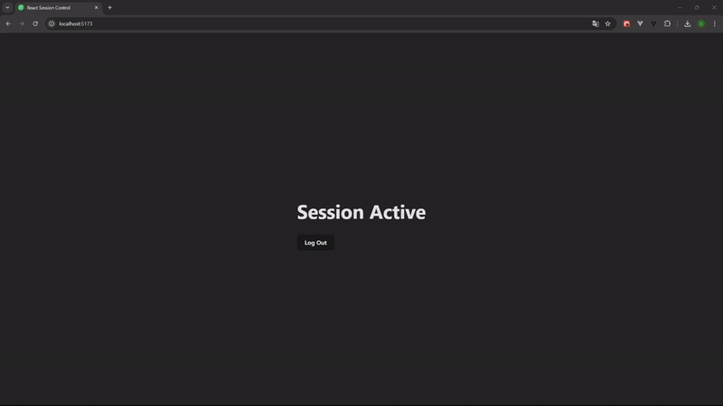

# Control de Sesión en React

Este repositorio contiene un hook personalizado de React llamado `useSessionControl`, que ayuda a gestionar el estado de la sesión entre varias pestañas del navegador. La solución asegura que, cuando un usuario tiene la misma aplicación abierta en varias pestañas, el estado de la sesión se sincronice y solo una pestaña pueda tener una sesión activa a la vez. Si el usuario cambia de pestaña o abre una nueva, la sesión se transfiere o se cierra según corresponda.



## ✨ Descripción

En las aplicaciones web modernas, es común que los usuarios tengan varias pestañas abiertas al mismo tiempo. Sin embargo, esto puede llevar a inconsistencias al gestionar sesiones, ya que una sesión puede estar abierta en una pestaña sin que el usuario sepa que también está activa en otra. Esta solución asegura que:

1. Un usuario solo pueda tener una sesión activa en todas las pestañas.
2. Si se abre una nueva pestaña, esta se convierte en la sesión activa, y las otras pestañas muestran que la sesión está abierta en otro lugar.
3. Cuando la sesión se reactiva en una pestaña, se cierra en todas las demás.

Esto se logra utilizando la API de `localStorage` para compartir la información de la sesión entre pestañas y `useRef` para mantener un identificador constante de cada pestaña.

## 🛠️ Motivación

En algunas aplicaciones modernas, es importante hacer un seguimiento de las sesiones de usuario en diferentes pestañas. Sin este mecanismo, los usuarios podrían tener sesiones en conflicto entre varias pestañas, causando problemas como:

- El usuario podría cerrar la sesión en una pestaña sin saber que está interactuando con la aplicación en otra.
- Una pestaña puede no reflejar los cambios hechos en otra.

Al usar esta solución, aseguramos que la sesión se maneje correctamente, con la sesión activa exclusiva de una pestaña, informando al usuario cuando la sesión está abierta en otra.

## 🔧 Cómo Funciona

1. **Sincronización del Estado de Sesión**: El hook almacena el estado de la sesión (`active` o `inactive`) en `localStorage`, que es accesible en todas las pestañas.
2. **Identificación de Pestañas**: Cada pestaña obtiene un ID único generado por `uuidv4()`, lo que asegura que cada pestaña sea distinguible de las demás.
3. **Activación y Desactivación de Sesión**: Cuando una pestaña se abre, la sesión se establece como "activa" en esa pestaña. Si se abre otra pestaña, esta reconoce que la sesión ya está activa y notifica al usuario. Si el usuario activa la sesión en una pestaña, se desactiva en todas las demás.
4. **Escucha de Eventos de Almacenamiento**: El evento `storage` se usa para escuchar cambios en `localStorage` (como abrir o cerrar la sesión en otra pestaña), lo que permite que la aplicación actualice la interfaz de usuario de manera reactiva.

### Flujo de Código

- Al cargar la aplicación, el hook verifica si ya hay una sesión activa leyendo desde `localStorage`.
- Si hay una sesión activa en otra pestaña, informa al usuario y ofrece la opción de transferir la sesión a la pestaña actual.
- Si la sesión se cierra en una pestaña, también se elimina de `localStorage`, afectando a todas las demás pestañas.

## Ventajas

- **Consistencia**: Asegura que el estado de la sesión sea consistente en todas las pestañas.
- **Amigable para el Usuario**: Notifica al usuario cuando la sesión está activa en otra pestaña y ofrece una manera de transferir la sesión a la pestaña actual.
- **Rendimiento**: Usar `useRef` asegura que el identificador de la pestaña se mantenga constante a lo largo del ciclo de vida del componente sin desencadenar renders innecesarios.
- **Escalabilidad**: Este enfoque puede ampliarse a escenarios más complejos, como gestionar el estado del usuario en diferentes ventanas o incluso navegadores (con lógica adicional).

## Instalación

Para instalar y usar este proyecto, sigue estos pasos:

1. Clona el repositorio:

   ```bash
   git clone https://github.com/Ivanruii/react-session-control.git
   ```

2. Instala las dependencias:
   ```bash
   cd react-session-control
   npm install
   ```

## Uso

1. Importa el hook personalizado `useSessionControl` en tu componente de React:

   ```tsx
   import useSessionControl from "./use-session-control.hook";
   ```

2. Llama al hook en tu componente:

   ```tsx
   const { sessionActive, otherTabActive, startSession, endSession } =
     useSessionControl();
   ```

3. Usa el estado de la sesión y los métodos en tu componente para mostrar la interfaz de usuario adecuada:
   ```tsx
   return (
     <div>
       {sessionActive ? (
         <>
           <h1>Session Active</h1>
           <button onClick={endSession}>End Session</button>
         </>
       ) : otherTabActive ? (
         <>
           <h1>Session Open in Another Tab</h1>
           <button onClick={startSession}>Transfer Session to This Tab</button>
         </>
       ) : (
         <h1>Session Closed</h1>
       )}
     </div>
   );
   ```
